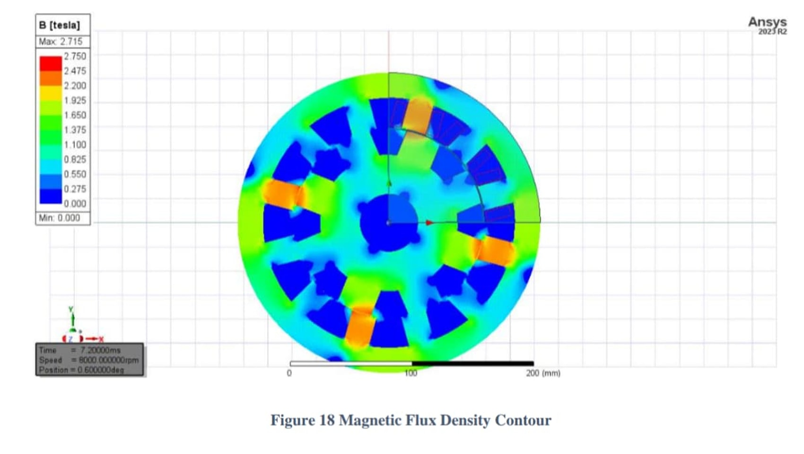
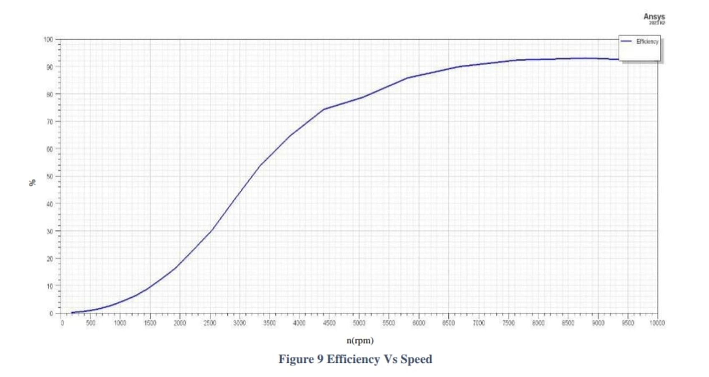
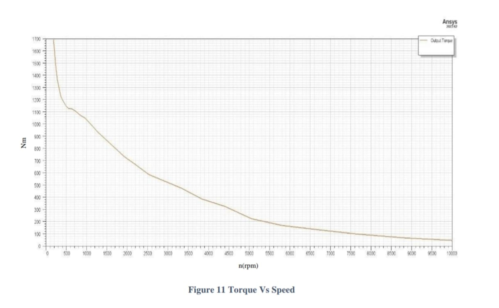

# 100kW 12/8 Switched Reluctance Motor (SRM) for EV Traction
**Optimized Electromagnetic Design and 2D FEA Simulation using ANSYS Maxwell**

This repository contains the complete electromagnetic design, simulation data, and performance analysis of a high-power 12/8 Switched Reluctance Motor engineered specifically for high-speed Electric Vehicle (EV) powertrains. 

## 📊 Key Performance Metrics
* **Peak Power:** 100 kW 
* **Rated Speed:** 8,000 RPM
* **DC Bus Voltage:** 440 V
* **Peak Torque:** 129.84 Nm
* **Maximum Efficiency:** 95.71%
* **Core Material:** NLMK NV35S-145 (Optimized for high-frequency low core loss)

---

## 🛠️ Engineering Optimization & Results

### 1. Excitation & Control Tuning
To maximize efficiency and mitigate the torque ripple inherent to SRMs, an asymmetric half-bridge converter was modeled. 
* **Lead Angle Optimization:** Swept from 22.0° to 23.0°. Fixed at **22.5°** to yield the highest rated torque and minimize iron losses.
* **Trigger Pulse Width:** Optimized to **156.5°**, balancing single-pulse non-overlapping conduction with maximum torque generation.

### 2. Electromagnetic Finite Element Analysis (2D FEA)

* **Magnetic Saturation:** Peak flux density reaches ~2.7 T at the aligned stator/rotor tooth tips, confirming optimal magnetic material utilization without excessive leakage.

### 3. Torque & Efficiency Profiling

* The design achieves >90% efficiency in the crucial 6000-8000 RPM cruising range. 
* Starting torque peaks at ~1700 Nm, providing the necessary launch characteristics for heavy-load EV conditions.

* Torque ripple analysis confirms stable, periodic output matching the 156.5° conduction angle.

---

## 📁 Repository Structure
* `/ANSYS_Maxwell_Files/` - Contains the `.mxwl` project files, 2D mesh data, and RMxprt analytical setups.
* `/Documentation/` - Contains the full 80-page technical thesis detailing the mathematical baseline and comparative material analysis (NLMK vs. M19_29G).

---

## 💻 Tech Stack
* **FEA & Electromagnetic Modeling:** ANSYS Maxwell 2D, ANSYS RMxprt
* **CAD Geometry:** SolidWorks, AutoCAD
